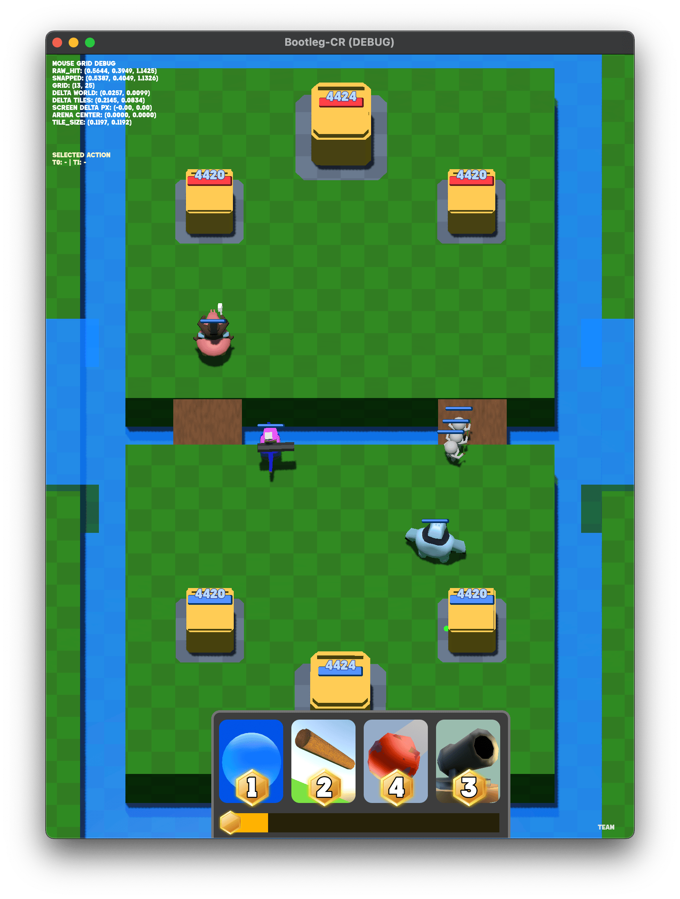
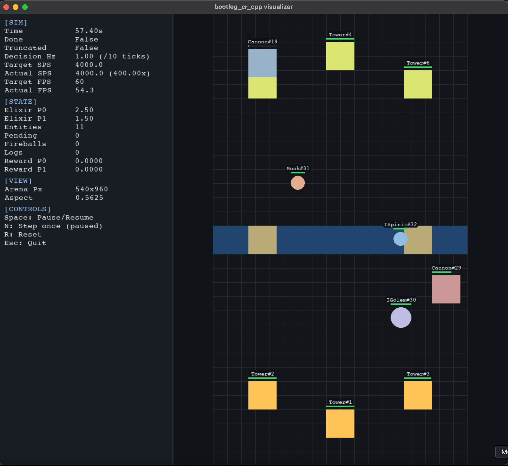

# Clash Royale Knockoff AI Bot

An experiment to see how well can RL algorithms can learn how to play a simplified version of Clash Royale. 

This repository pairs a Godot 4 front-end with a PPO training loop that runs against a native C++ simulation (`cpp`) and the Python training stack
(`training`).

<p align="center">
  
  
</p>

## Build

From repo root:

```bash
./cpp/build_backend.sh
```

The script checks for `pybind11`, invokes CMake in `cpp/build/`, and places the
resulting shared library/extension next to `py/training` so the gym can `import
knockoff_cr_cpp`. You can rerun it whenever the engine headers change.

## Training (cpp-backed)

Use the trainer. `--visualize` brings up a window with useful information.

```bash
python -m training.custom.train_ppo \
  --num-envs 8 \
  --visualize
```

## Stats

Use TensorBoard to view training stats:

```bash
tensorboard --logdir training/runs
```

## Testing

```bash
pytest training/tests/cpp_backend -q
```

Validate determinism/stability with `pytest -m slow ...`, and experiment with
`python -m training.tools.cpp_visualizer` if you need to inspect observations or
masking logic.
